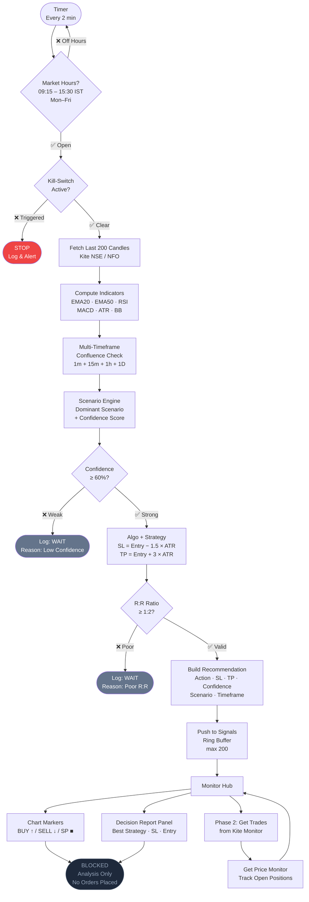
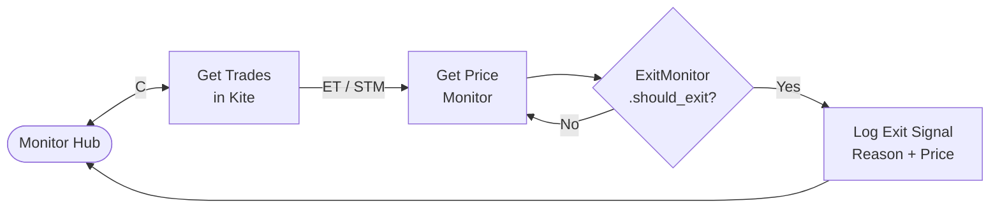

# Algo Engine Design — v1.0

> **Version**: 1.0  
> **Supersedes**: `ALGO_ENGINE_DESIGN_v0.1.md`  
> **Updated**: 2026-06-25  
> **Mode**: Analysis-Only (no live orders placed)

---

## Origin — Hand-Drawn Diagrams (2026-06-25)

These two diagrams were the original design sketches that drove this document.

### Sketch 1 — Phase 2 Core Loop

```
Phase 2

  ┌─────────┐         ┌──────────────────┐    ET/STM    ┌──────────────────┐
  │ Monitor │ ◄─────► │ Get Trades        │ ──────────► │ Get Price        │
  └─────────┘    C    │ in Kite           │             │ Monitor          │
                      └──────────────────┘             └──────────────────┘
```

**Reading**: The Monitor communicates bidirectionally with Kite to fetch open trades,
then feeds those into a price monitor loop (ET/STM = Exit Trigger / Stop Monitor).

---

### Sketch 2 — Full AI Engine Flow

```
  AI Goal ──► Fire an event every 1-2 min
                        │
                        ▼
              ┌──────────────────┐
              │  Fetch           │
              │  Historical Data │
              └────────┬─────────┘
                       │
                       ▼
              ┌──────────────────┐
              │  Validate        │
              │  Conditions      │
              └────────┬─────────┘
                       │
              Entry Decisions
                       │
                       ▼
              ┌──────────────────┐
              │  Strategy/Score  │◄────────────────────────────┐
              └──────┬───────────┘                             │
                     │                                         │
          ┌──────────┴──────────┐                             │
          ▼                     ▼                             │
   ┌─────────────┐    ┌─────────────────┐                    │
   │  Monitor    │    │  algo +         │                    │
   │  (central)  │    │  Strategy       │                    │
   └──────┬──────┘    └───────┬─────────┘                    │
          │                   │                               │
          ▼                   ▼                               │
   Decide in:       ┌──────────────────┐                     │
   - Trading        │  Entry Strategy  │                     │
     Ability        └───────┬──────────┘                     │
   - Study/                 │                                │
     Analysis        Check USR/M Validation                  │
   - Condition              │                                │
          │           ┌─────┴──────┐                        │
          │           │            │                         │
          ▼        fail ▼        pass ▼                      │
   Report:      Stop and      Execute via                    │
   Best         Modify        API (Creds)                    │
   Strategy ─────────────────────────────────────────────────┘
   Best SL                       │
   Entry                         ▼
                              BLOCKED
```

**Reading**: The AI fires every 1-2 min, fetches data, validates entry conditions,
scores strategy, runs the monitor decision hub (trading ability + study + conditions),
generates a best-strategy report, and any execution attempt is permanently blocked.

---

## What Changed from v0.1

| Area | v0.1 | v1.0 |
|------|------|------|
| Flow trigger | Manual / scheduler tick | Timer every 2 min + **6 safety guards** |
| Timeframe | Single timeframe | **Multi-timeframe: 1m + 15m + 1h + 1D** |
| Session gate | Not explicit | **09:15–15:30 IST, Mon–Fri only** |
| Kill-switch | Listed as a checklist item | **First check before any computation** |
| Confidence gate | Stage 4 checklist | **Explicit gate node — logs WAIT with reason** |
| R:R gate | Stage 4 checklist | **Explicit gate node — logs WAIT with reason** |
| Execution | Stage 5 wired to Kite | **BLOCKED — analysis + recommendation only** |
| UI output | Signal feed cards | **Chart markers + Decision Report Panel + Monitor Hub** |
| Position monitor | Stage 6 polling loop | **Phase 2: Monitor ↔ Kite price stream** |

---

## 1. Design Goals

1. Fire an analysis cycle every **2 minutes** during market hours
2. Fetch only the **last 200 candles** (not full history) per cycle — avoids Kite rate limits
3. Compute indicators across **4 timeframes** for confluence
4. Score each scenario — only proceed when dominant scenario **confidence ≥ 60%**
5. Validate R:R — only surface setups where **R:R ≥ 1:2** (SL = 1.5×ATR, TP = 3×ATR)
6. Push results to a **signal ring buffer** (max 200) readable by the UI
7. Render signals as **chart markers** and a **Decision Report Panel**
8. **Never place orders** — all signals are recommendations only (HTTP 403 on order endpoints)

---

## 2. Full Flow

```
┌─────────────────────────────────────────────────────────────────────────────┐
│                        ALGO ENGINE v1.0 — FULL PIPELINE                     │
│                                                                             │
│  ┌──────────────┐                                                           │
│  │ Timer        │  fires every 2 min                                        │
│  │ (APScheduler)│                                                           │
│  └──────┬───────┘                                                           │
│         │                                                                   │
│  GUARD 1 ── Market Hours?  09:15–15:30 IST, Mon–Fri                        │
│         │   NO  →  skip cycle, reschedule                                   │
│         │   YES ↓                                                           │
│                                                                             │
│  GUARD 2 ── Kill-Switch Active?  (in-process flag | Redis | flag file)      │
│         │   YES →  STOP, log alert                                          │
│         │   NO  ↓                                                           │
│                                                                             │
│  STAGE 1 ── Data Ingestion                                                  │
│         │   lookup_instrument_token(exchange, symbol)                       │
│         │   get_ohlcv_df(token, symbol, interval, last=200)                 │
│         │   → 4 calls: 1m · 15m · 1h · 1D                                  │
│         ↓                                                                   │
│  STAGE 2 ── Indicator Computation                                           │
│         │   compute_indicators(df_1m)  + compute_indicators(df_1h)         │
│         │   EMA20 · EMA50 · EMA200 · RSI · MACD · ATR · BB · Stochastic    │
│         │   → per-candle arrays for chart overlay                           │
│         ↓                                                                   │
│  STAGE 3 ── Multi-Timeframe Confluence                                      │
│         │   score each timeframe trend (BULLISH / BEARISH / NEUTRAL)       │
│         │   confluence_score = count of aligned timeframes / 4              │
│         │   (e.g. 3/4 aligned = 75% confluence)                             │
│         ↓                                                                   │
│  STAGE 4 ── Scenario Engine                                                 │
│         │   ScenarioEngine.score_scenarios(indicators)                      │
│         │   → dominant_scenario, confidence (0–100%)                       │
│         │                                                                   │
│  GUARD 3 ── Confidence ≥ 60%?                                               │
│         │   NO  →  Log WAIT (reason: low confidence)                        │
│         │   YES ↓                                                           │
│                                                                             │
│  STAGE 5 ── Strategy Evaluation                                             │
│         │   evaluate_all(symbol, indicators, scenario, confidence)          │
│         │   → list[AlgoSignal]  (each has action, entry, SL, TP, score)    │
│         ↓                                                                   │
│  STAGE 6 ── R:R Validation                                                  │
│         │   SL  = entry_price − 1.5 × ATR                                  │
│         │   TP  = entry_price + 3.0 × ATR                                  │
│         │   R:R = (TP − entry) / (entry − SL)                              │
│                                                                             │
│  GUARD 4 ── R:R ≥ 1:2?                                                      │
│         │   NO  →  Log WAIT (reason: poor R:R)                              │
│         │   YES ↓                                                           │
│                                                                             │
│  GUARD 5 ── Daily Loss Limit OK?  (max 2% of opening capital)               │
│         │   NO  →  STOP, activate kill-switch                               │
│         │   YES ↓                                                           │
│                                                                             │
│  GUARD 6 ── Position Size OK?  (max 5% of capital per trade)                │
│         │   NO  →  Log WAIT (reason: sizing breach)                         │
│         │   YES ↓                                                           │
│                                                                             │
│  STAGE 7 ── Build Recommendation                                            │
│         │   AlgoSignal {                                                    │
│         │     action      : BUY | SELL | WAIT                              │
│         │     symbol      : str                                             │
│         │     entry_price : float                                           │
│         │     suggested_sl: float                                           │
│         │     suggested_tp: float                                           │
│         │     rr_ratio    : float                                           │
│         │     confidence  : float                                           │
│         │     scenario    : str                                             │
│         │     timeframes  : list[str]                                       │
│         │     reason      : str                                             │
│         │     timestamp   : ISO-8601 IST                                    │
│         │   }                                                               │
│         ↓                                                                   │
│  STAGE 8 ── Push to Ring Buffer                                             │
│         │   state.signals = [new, ...old][:200]                             │
│         │   db_logger.log_signal(signal)   ← TimescaleDB                   │
│         ↓                                                                   │
│  STAGE 9 ── UI Output (Monitor Hub)                                         │
│         │                                                                   │
│         ├──► Chart Markers                                                  │
│         │    BUY  → green ↑ arrow (belowBar)                               │
│         │    SELL → red   ↓ arrow (aboveBar)                               │
│         │    SP   → orange ■ square (inBar)                                 │
│         │                                                                   │
│         ├──► Decision Report Panel                                          │
│         │    Best strategy · SL · TP · Confidence · Scenario               │
│         │                                                                   │
│         └──► BLOCKED  (analysis-only, HTTP 403 on all order endpoints)     │
│                                                                             │
│  ─ ─ ─ ─ ─ ─ ─ ─ ─  PHASE 2: POSITION MONITOR  ─ ─ ─ ─ ─ ─ ─ ─ ─ ─ ─   │
│                                                                             │
│  Monitor Hub  ↔  Get Trades (Kite)  →  Get Price Monitor                   │
│       poll every 30 s → ExitMonitor.should_exit() → update UI              │
│                                                                             │
└─────────────────────────────────────────────────────────────────────────────┘
```

---

## 3. Flow Diagrams (Mermaid)

### 3a. High-Level Guard Flow



---

### 3b. Full 9-Stage Pipeline

```mermaid
flowchart TD
    T([APScheduler\nTick every 2 min])

    T --> G1{GUARD 1\nMarket Hours?\n09:15–15:30 IST\nMon–Fri}
    G1 -- No --> T
    G1 -- Yes --> G2{GUARD 2\nKill-Switch?}
    G2 -- Active --> KS([STOP\nLog Alert])
    G2 -- Clear --> S1

    subgraph S1 [Stage 1 · Data Ingestion]
        D1[lookup_instrument_token\nexchange · symbol]
        D2[get_ohlcv_df\nlast 200 candles\n× 4 timeframes]
        D1 --> D2
    end

    S1 --> S2

    subgraph S2 [Stage 2 · Indicator Computation]
        I1[compute_indicators\nEMA20/50/200\nRSI · MACD · ATR · BB · Stoch]
        I2[per-candle arrays\nfor chart overlay]
        I1 --> I2
    end

    S2 --> S3

    subgraph S3 [Stage 3 · Multi-Timeframe Confluence]
        MT1[Score each TF\n1m · 15m · 1h · 1D]
        MT2[confluence_score\n= aligned / 4]
        MT1 --> MT2
    end

    S3 --> S4

    subgraph S4 [Stage 4 · Scenario Engine]
        SC1[ScenarioEngine\n.score_scenarios]
        SC2[dominant_scenario\n+ confidence %]
        SC1 --> SC2
    end

    S4 --> G3{GUARD 3\nConfidence ≥ 60%?}
    G3 -- No --> W1([WAIT\nLow Confidence])
    G3 -- Yes --> S5

    subgraph S5 [Stage 5 · Strategy Evaluation]
        ST1[evaluate_all\nsymbol · indicators\nscenario · confidence]
        ST2[AlgoSignal list\naction · entry · SL · TP · score]
        ST1 --> ST2
    end

    S5 --> S6

    subgraph S6 [Stage 6 · R:R Validation]
        RR1["SL = entry − 1.5 × ATR\nTP = entry + 3.0 × ATR\nR:R = TP−entry / entry−SL"]
    end

    S6 --> G4{GUARD 4\nR:R ≥ 1:2?}
    G4 -- No --> W2([WAIT\nPoor R:R])
    G4 -- Yes --> G5{GUARD 5\nDaily Loss OK?\n< 2% capital}
    G5 -- No --> KS2([STOP + Kill-Switch])
    G5 -- Yes --> G6{GUARD 6\nPosition Size OK?\n≤ 5% capital}
    G6 -- No --> W3([WAIT\nSizing Breach])
    G6 -- Yes --> S7

    subgraph S7 [Stage 7 · Build Recommendation]
        R1[AlgoSignal\naction · entry · SL · TP\nrr_ratio · confidence\nscenario · timeframes\nreason · timestamp IST]
    end

    S7 --> S8

    subgraph S8 [Stage 8 · Ring Buffer + DB Log]
        RB1[state.signals prepend\nmax 200]
        RB2[db_logger.log_signal\nTimescaleDB]
        RB1 --> RB2
    end

    S8 --> S9

    subgraph S9 [Stage 9 · UI Output — Monitor Hub]
        UI1[Chart Markers\nBUY ↑ · SELL ↓ · SP ■]
        UI2[Decision Report Panel\nbest strategy · SL · TP · confidence]
        UI3[BLOCKED\nHTTP 403\nAnalysis-Only]
        UI1 --> UI3
        UI2 --> UI3
    end

    S9 --> P2

    subgraph P2 [Phase 2 · Position Monitor]
        PM1[Monitor Hub]
        PM2[Get Trades · Kite]
        PM3[Get Price Monitor\npoll every 30s]
        PM4[ExitMonitor\n.should_exit]
        PM1 <--> PM2
        PM2 --> PM3
        PM3 --> PM4
        PM4 --> PM1
    end
```



---

### 3c. Phase 2 — Position Monitor Detail



---

## 4. The 6 Guards — Detail

| Guard | Condition | On Fail |
|-------|-----------|---------|
| **G1** Market Hours | 09:15–15:30 IST, Mon–Fri | Skip cycle silently |
| **G2** Kill-Switch | in-process flag `OR` Redis key `OR` flag file | Stop engine, log alert |
| **G3** Confidence | `dominant_scenario.confidence ≥ 60%` | Log WAIT + reason |
| **G4** R:R Ratio | `(TP − entry) / (entry − SL) ≥ 2.0` | Log WAIT + reason |
| **G5** Daily Loss | Current day P&L loss `< 2%` of opening capital | Stop + activate kill-switch |
| **G6** Position Size | `qty × entry_price ≤ 5%` of capital | Log WAIT + reason |

---

## 5. Multi-Timeframe Confluence Rules

All 4 timeframes are scored independently. A signal is only valid when ≥ 3 of 4 agree.

| Timeframe | Role | Data window |
|-----------|------|-------------|
| `1m` | Entry timing (noise filter) | Last 200 candles |
| `15m` | Intraday trend | Last 200 candles |
| `1h` | Session structure | Last 200 candles |
| `1D` | Macro trend / bias | Last 200 candles |

Confluence score = `aligned_count / 4`.  
Gate: confluence_score `≥ 0.75` (3 of 4 timeframes aligned).

---

## 6. Signal Data Contract

```json
{
  "id":           "uuid-v4",
  "symbol":       "RELIANCE",
  "exchange":     "NSE",
  "action":       "BUY",
  "entry_price":  2850.50,
  "suggested_sl": 2820.25,
  "suggested_tp": 2911.00,
  "rr_ratio":     2.03,
  "confidence":   72.5,
  "scenario":     "BREAKOUT",
  "timeframes":   ["15m", "1h", "1D"],
  "confluence":   0.75,
  "reason":       "EMA20 cross above EMA50, RSI 58, MACD bullish",
  "checklist": {
    "market_hours":         true,
    "kill_switch_off":      true,
    "confidence_ok":        true,
    "rr_ok":                true,
    "daily_loss_ok":        true,
    "position_size_ok":     true
  },
  "execution_note": "BLOCKED — analysis-only mode",
  "timestamp":    "2026-06-25T10:32:00+05:30"
}
```

---

## 7. UI Components — Monitor Hub

```
Dashboard
│
├── CandleChart          ← chart markers (BUY ↑ / SELL ↓ / SP ■)
├── IndicatorPanel       ← scalar values (RSI, MACD, ATR)
├── ScenarioPanel        ← dominant scenario + confidence bar      [❌ placeholder → needs wiring]
│
└── Monitor Hub (new)
    ├── DecisionReport   ← best signal for current symbol: action, SL, TP, R:R, confidence
    ├── SignalFeed        ← last 20 signals with timestamps + reasons
    └── EngineStatus      ← scheduler state, last run time, next run countdown
```

---

## 8. Backend File Map

### Exists ✅

| File | Purpose |
|------|---------|
| `src/utils/algo_engine.py` | `EngineState`, `run_cycle()`, scheduler loop |
| `src/utils/algo_strategies.py` | Strategy classes, `AlgoSignal`, `STRATEGY_REGISTRY` |
| `src/utils/technical_analysis.py` | `compute_indicators()` |
| `src/utils/scenario_engine.py` | `ScenarioEngine.score_scenarios()` |
| `src/utils/rr_calculator.py` | `calculate_sl_tp()` — ATR-based |
| `src/utils/risk_manager.py` | Kill-switch (3-tier), daily-loss gate, position sizing |
| `src/utils/exit_monitor.py` | `ExitMonitor.should_exit()` — 6 exit rules |
| `src/tools/kite_tools.py` | `KiteOrderManager` (BLOCKED in analysis mode) |
| `src/tools/historical_data.py` | Historical data manager |
| `src/api/routers/algo.py` | `/algo/*` — 6 REST endpoints |
| `src/utils/db_logger.py` | TimescaleDB signal logging |

### Needs Building ❌

| File | Purpose |
|------|---------|
| `src/utils/multi_timeframe.py` | Fetch + score 4 timeframes, return confluence result |
| `src/api/routers/indicators.py` | `/api/indicators/{symbol}` — returns per-candle EMA/RSI arrays |
| `src/utils/position_manager.py` | `ActivePosition` registry + P&L tracker |
| `src/utils/position_monitor_loop.py` | Async polling loop → ExitMonitor → Phase 2 |

---

## 9. Frontend File Map

### Exists ✅

| File | Purpose |
|------|---------|
| `features/chart/CandleChart.jsx` | Chart rendering |
| `features/chart/useChartAdapter.js` | `setCandles / setIndicators / setSignals / setSPWarnings` |
| `features/analysis/IndicatorPanel.jsx` | Scalar indicator display |
| `features/algo/SignalFeed.jsx` | Signal cards |
| `features/algo/AlgoEngine.jsx` | Engine status + Run button |
| `services/api.js` | `getAlgoSignals`, `fetchIndicators` |

### Needs Building ❌

| File | Purpose |
|------|---------|
| `features/algo/DecisionReport.jsx` | Best signal panel: action pill, SL/TP, confidence badge |
| `features/analysis/ScenarioPanel.jsx` | Replace placeholder with real scenario data |
| `hooks/useSignalMarkers.js` | Polls `/algo/signals`, calls `setSignals()` on chart |
| `hooks/useIndicatorOverlay.js` | Fetches per-candle EMA arrays, calls `setIndicators()` |
| `features/algo/EngineStatus.jsx` | Scheduler state, last run, next run countdown |

---

## 10. Build Order (Recommended)

| Step | What | Unblocks |
|------|------|---------|
| **1** | `useSignalMarkers` hook + wire to chart | Chart markers visible immediately |
| **2** | `/api/indicators/{symbol}` backend endpoint | Per-candle EMA/RSI series |
| **3** | `useIndicatorOverlay` hook + wire to chart | EMA line overlays on chart |
| **4** | Real `ScenarioPanel` | Scenario + confidence live |
| **5** | `DecisionReport` panel | Best strategy report on Dashboard |
| **6** | `multi_timeframe.py` + integrate in `run_cycle` | 4-timeframe confluence |
| **7** | `position_manager.py` + `position_monitor_loop.py` | Phase 2 position monitor |

---

## 11. Key Constraints (Non-Negotiable)

- **R:R gate**: SL = `entry − 1.5 × ATR`, TP = `entry + 3 × ATR`. R:R must be ≥ 1:2
- **Scenario gate**: confidence ≥ 60% before any recommendation
- **Kill-switch**: 3-tier — in-process flag, Redis key `trading_kill_switch`, flag file (`tempfile.gettempdir()/trading_kill_switch`)
- **Market hours**: 09:15–15:30 IST only. All timestamps in IST (+05:30)
- **Position size**: Max 5% of capital per signal
- **Daily loss**: Max 2% of opening capital — triggers kill-switch if breached
- **Analysis only**: HTTP 403 on all order placement endpoints. No live trades
- **lightweight-charts**: Pinned at `4.2.0` — do NOT upgrade to 5.x
